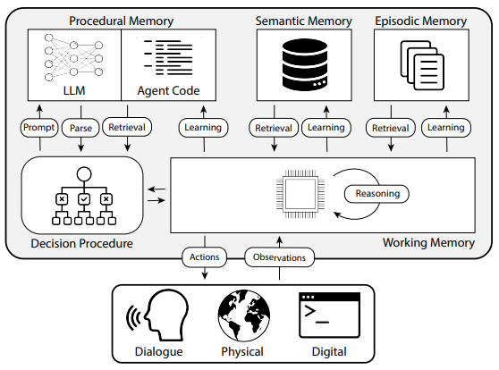

# Claude Code Decaf

An educational re-implementation of Claude Code that makes the agent loop, memory system, and tool execution fully transparent and explainable.

Every design decision prioritises **explainability over completeness**. If a feature obscures how the agent works, it is out of scope.


## Concepts

- How an agentic coding assistant works under the hood
- The tool dispatch loop: model → tool calls → results → model
- CoALA memory architecture: semantic, episodic, working, procedural
- How ReAct (think → act → observe) drives the loop while CoALA organises the state it operates over
- Extended thinking: visible chain-of-thought reasoning
- Event-driven architecture with structured logging

## CoALA


https://arxiv.org/pdf/2309.02427

## Agent Loop

The loop is fully async. It runs until the model stops calling tools.

```
1. Load CLAUDE.md → inject into system prompt      (semantic memory)
2. Load MEMORY.md first 200 lines → inject         (episodic memory)
3. Scan tools/ for SKILL.md → load tool_definitions and tool_functions
   (procedural memory — dynamic discovery via tools/loader.py)
4. Emit SessionStart

loop:
    5.  await provider.send(messages, tool_definitions, system_prompt)
    6.  Receive ProviderResponse (thinking blocks + content blocks)
    7.  If no tool calls → emit Stop → return to REPL
    8.  For each tool call:
            a. Emit PreToolUse
            b. If tool_name in approval_required 
                → await ApprovalListener(tool_name, tool_input)
            c. await tool_functions[tool_name](**tool_input)
            d. Emit PostToolUse
            e. Append tool result to conversation history
               (preserve thinking blocks in raw_content — required by API)
    9.  Log token count (total + thinking)
    10. Go to 5
```

## Architecture

```
main.py (CLI + REPL)
└── agent.py (agent loop)
    ├── providers/anthropic.py (API wrapper + extended thinking)
    ├── events.py (pub/sub event bus)
    │   └── listeners/
    │       ├── ui.py         (terminal rendering)
    │       ├── logging.py    (JSONL structured logs)
    │       └── approval.py   (human-in-the-loop)
    └── tools/
        ├── loader.py         (dynamic discovery)
        ├── read_file/        (Python tool)
        ├── write_file/       (Python tool)
        ├── find_files/       (Python tool)
        ├── list_directory/   (Python tool)
        ├── run_bash/         (Python tool)
        ├── update_memory/    (Python tool)
        └── prettier/         (CLI tool auto-wrapped)
```

8 core source files. No frameworks. No magic.

## Prerequisites

- Python 3.12+
- An Anthropic API key

## Install

```bash
git clone <repo-url> claude-code-decaf
cd claude-code-decaf
python -m venv .venv
source .venv/bin/activate
pip install anthropic rich aioconsole pyyaml
```

## Configure

```bash
export ANTHROPIC_API_KEY="sk-ant-..."
```

Optionally create a `CLAUDE.md` in the project root with knowledge the assistant should always have:

```markdown
# Project
- Python 3.12, use uv not pip
- Tests: pytest, run before every commit
```

## Run

```bash
python main.py
```

```
> list the files in this directory
```

You will see:

1. A dimmed panel showing the model's thinking process
2. Tool calls and their results
3. The assistant's final response
4. Token usage (total and thinking)

## CLI flags

| Flag | Default | Description |
|------|---------|-------------|
| `--model` | `claude-sonnet-4-20250514` | Anthropic model to use |
| `--max-tokens` | `16000` | Max tokens per response |
| `--thinking-budget` | `10000` | Tokens reserved for thinking |
| `--max-tool-output` | `10000` | Max characters per tool result |
| `--tool-timeout` | `120` | Tool execution timeout (seconds) |

## Memory system

Based on the [CoALA cognitive architecture](https://arxiv.org/abs/2309.02427):

| Type | File | Author | Persists? |
|------|------|--------|-----------|
| Semantic | `CLAUDE.md` | Developer | Yes |
| Episodic | `.memory/MEMORY.md` | Agent | Yes |
| Working | Context window | Both | No |
| Procedural | `SKILL.md` + `tool.py` | Developer | Yes |

### Memory Types in Practice

- **Working Memory** Because LLMs are stateless, conversation history must be maintained explicitly across decision cycles. The live context window (`conversation_history` in `agent.py`) serves this role, and token usage is logged each turn to keep it observable.
  
  *Example:*
  ```python
  # agent.py
  self.conversation_history: list[dict] = []
  
  # Each user input and model response is appended
  self.conversation_history.append({"role": "user", "content": user_input})
  self.conversation_history.append({"role": "assistant", "content": response})
  ```

- **Procedural Memory** The agent's capabilities are extended through a modular tool system: CLI-based or Python-based tools that the agent discovers and invokes at runtime. Each tool is defined by a schema (`tool.py`) and a usage guide (`SKILL.md`).
  
  *Example:*
  ```
  tools/read_file/
  ├── SKILL.md        # Usage guide: when to use, parameters
  └── tool.py         # Tool schema + async implementation
  
  tools/run_bash/
  ├── SKILL.md
  └── tool.py
  ```

- **Semantic Memory** Project knowledge is written by the developer in guidance files like `CLAUDE.md` (project structure and conventions) and `CONSTITUTION.md` (principles and rules), then loaded at startup. In production systems this store is typically a vector database (e.g., ChromaDB), where RAG lets the agent retrieve only the most relevant chunks at query time without exceeding the context window. Here we load everything at startup, which is simpler but does not scale.
  
  *Example:*
  ```markdown
  # CLAUDE.md
  # Project
  - Python 3.12, use `uv` not `pip`
  - Tests: `pytest`, run before every commit
  - Database: PostgreSQL 14+
  ```

- **Episodic Memory** Facts and outcomes the agent learns during a session are persisted to `.memory/MEMORY.md` via the `update_memory` tool. This file is loaded at the start of each new session, letting the agent build on past interactions over time.
  
  *Example:*
  ```
  # .memory/MEMORY.md
  
  ## Session 2026-03-29
  - pytest in tests/ requires conftest.py with fixtures 
    (learned: import error if conftest not in python path)
  - Environment variable UV_PYTHON must be set for uv subprocess calls
    (learned: subprocess calls inherit parent environment)
  ```

## Add a tool

Create a folder under `tools/` with a `SKILL.md`:

```bash
mkdir tools/my_tool
```

**Python tool** add `SKILL.md` + `tool.py`:

```python
# tools/my_tool/tool.py
SCHEMA = {
    "name": "my_tool",
    "description": "Does something useful.",
    "input_schema": {
        "type": "object",
        "properties": {
            "arg": {"type": "string", "description": "An argument."}
        },
        "required": ["arg"]
    }
}

async def my_tool(arg: str) -> str:
    return f"Result for {arg}"
```

**CLI tool** add only `SKILL.md` (a subprocess wrapper is generated automatically).

To require approval before execution, add the tool name to `tools/config.yaml`:

```yaml
approval_required:
  - write_file
  - run_bash
  - my_tool
```

Restart the assistant. No existing files need editing.

## View logs

Session logs are written to `.logs/` as JSONL:

```bash
cat .logs/*.jsonl | python -m json.tool --json-lines
```

Each line is a JSON object with `ts`, `event`, and `data` fields:

```json
{"ts": "...", "event": "SessionStart",  "data": {"tools_loaded": [...], "claude_md_lines": 12}}
{"ts": "...", "event": "PreToolUse",    "data": {"tool": "read_file", "args": {"path": "auth.py"}}}
{"ts": "...", "event": "PostToolUse",   "data": {"tool": "read_file", "total_tokens": 3210}}
{"ts": "...", "event": "Stop",          "data": {"total_tokens": 4100, "thinking_tokens": 83, "tool_calls": 2}}
```

## How ReAct and CoALA fit together

**[CoALA](https://arxiv.org/abs/2309.02427)** organises *where* information lives (the four memory types above).  
**[ReAct](https://arxiv.org/pdf/2210.03629)** defines *how* the agent uses it: a repeating **Thought → Action → Observation** loop.

Each decision cycle:

1. **Thought** reason over working memory (which includes the loaded `CLAUDE.md` and `MEMORY.md`)
2. **Action** pick and execute a tool from procedural memory
3. **Observation** fold the result back into working memory, repeat or stop

After the loop ends, `update_memory` can persist what was learned to episodic memory for future sessions.

## Guidance files

| File | Purpose | CoALA type |
|------|---------|------------|
| `CLAUDE.md` | *What is this project?* structure, stack, conventions | Semantic (mostly) |
| `CONSTITUTION.md` | *How must we build it?* principles, rules, constraints | Procedural |

## Out of scope (by design)

| Feature | Why excluded |
|---------|-------------|
| Streaming | Adds async generator complexity before the basic loop is understood |
| Sub-agents | Adds a second loop before the first is understood |
| RAG: Vector retrieval | Adds infrastructure unrelated to the core loop |
| MCP servers | External protocol layer is out of scope |
| Context compaction | Production problem, not a learning problem |
| Auto memory | Implicit writes obscure the mechanism; `update_memory` is explicit |

## Token use observation (for spec-kit)

 npx ccusage@latest session
 
 claude-monitor

## Claude Agent SDK
All of this would already be integrated in the Claude Agent SDK: https://platform.claude.com/docs/en/agent-sdk/agent-loop